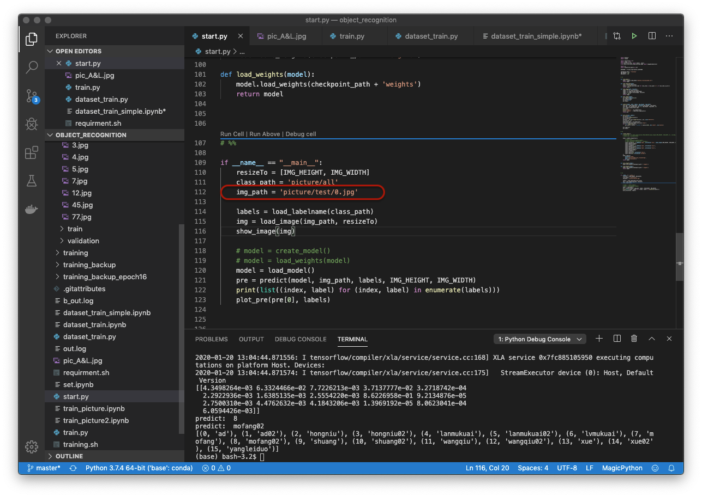
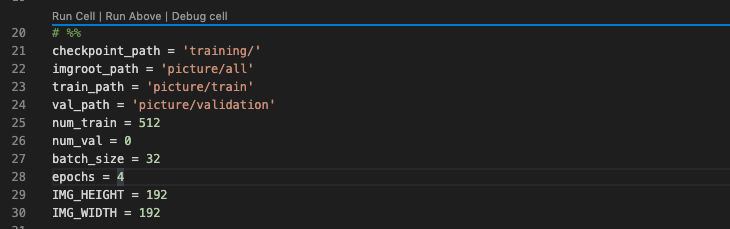
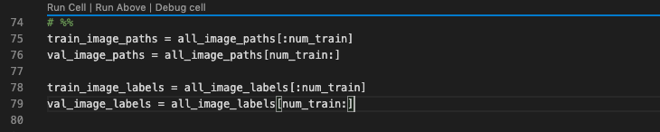

# object_recognition


A trainned model that can recognize the objects in the path 'picture/all'.

根据 ```'picture/all'``` 里的图片训练的模型，最新模型路径 ```'dataset_training/model.h5'```.


### 测试模型

1. 将 ```'picture/图像识别图片/'``` 里挑出要测试的图片拷贝到 ```'picture/test/'``` 目录下。
2. 修改 ```start.py``` 中 ```if __name__ == "__main__":``` 里的 ```img_path``` 变量为需要测试的图片路径。



3. RUN IT!


### 训练模型

训练模型的 python 脚本是 dataset_training.py .

1. 训练图片路径为 ```/picture/all```，可以增加图片样本数，要记得改 train 和 validation 的数量，仅改 ```num_train``` 变量的值即可，如下图是 ```num_train``` 的位置，和分割验证集的定义。





如要更改分类数或模型结构，请更改 ```create_model()``` 函数内的内容。目前使用简单迁移模型，保存的模型包括模型结构和权重。
